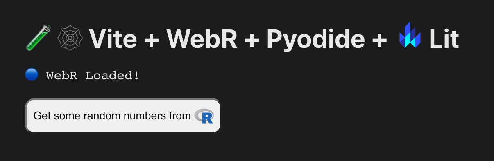

# 🧪 Experimenting With Observable Shorthand Plots, WebR, and Lit+Vite

## Letting R Data Drive Many Observable Plots

Experiment parameters:

- Webr
- R template tag function
- Observable Plot (shorhand version)
- Lit (web components)
- Vite (for building)
- hrbrmstr's lame CSS skills

Info is [here](https://rud.is/w/webr-lit-plot/)

